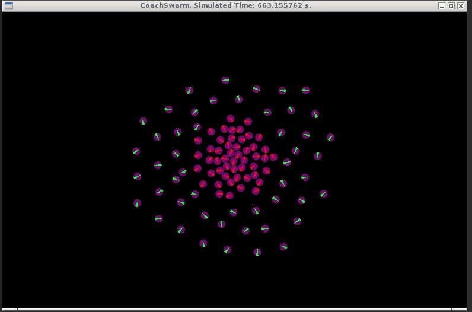
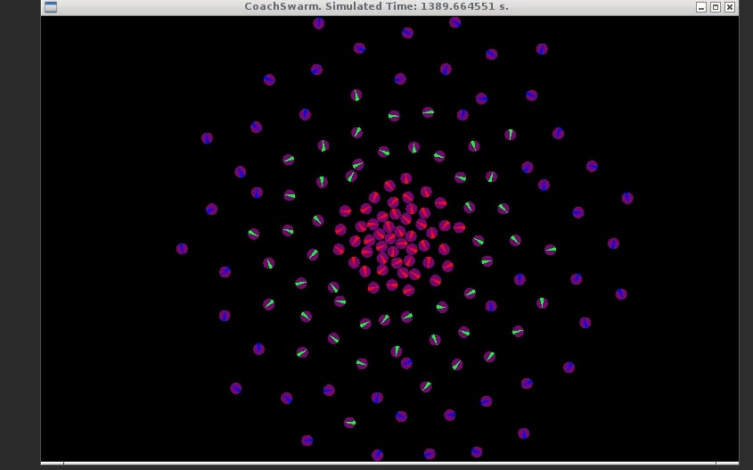

## Brazilian Nut Simulation 

Brazilian nut based algorithm used to filter differential drive robot with different virtual radii for repulsion. This is based on the following paper: "Segregation in Swarms of e-puck Robots Based On the Brazil Nut Effect".

Each differential-drive robot emulates the following virtual forces. All robots are attracted to the origin of the environment. They also repel from other robots within different virtual radii. This creates the shell effect displayed below. Lastly, they also display random motion. 

Examples in steady state are scene below.

2 radii:

3 radii:

