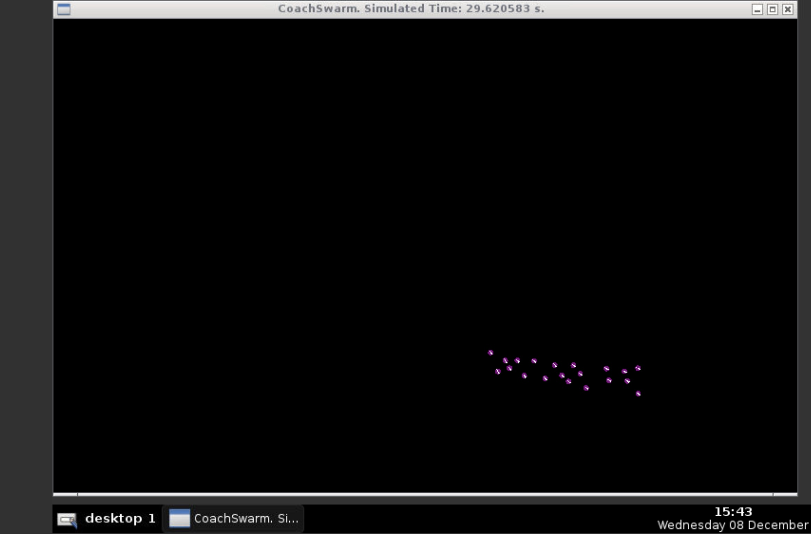

## Robot flocking

Swarm flocking algorithm used to coalesce robots and migrate towards a set point. This is based on work from the following paper: "Reynolds flocking in reality with fixed-wing robots: communication range vs. maximum turning rate"

Robots in this simulation migrate towards a set point. They exhibit several virtual forces to perform this behavior, specifically: robot to robot alignment, flock cohesion, robot repulsion, and migration attraction.

Robots in action:

