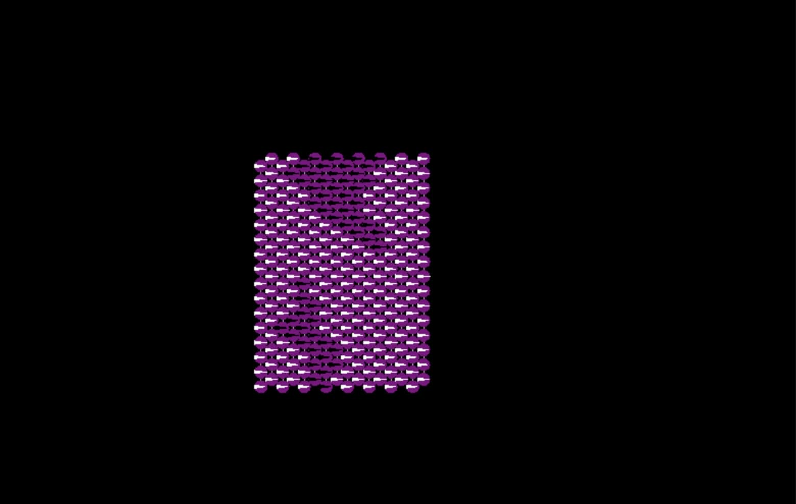
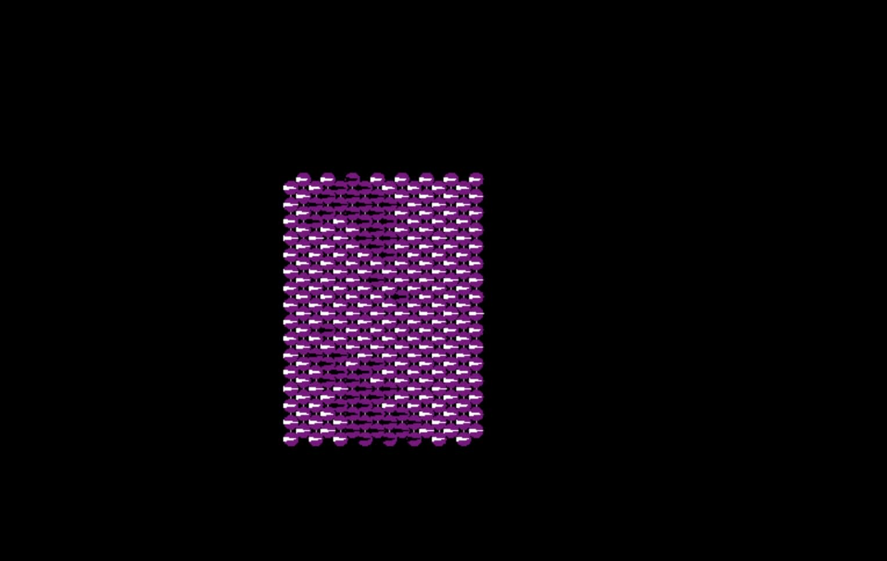

## Hop-count simulation

In this exercise, a hop count algorithm is used to create the letter "N" using an array of robot generating a virtual coordinate system. This is based on work from the following paper: "Organizing a Global Coordinate System from Local Information on an Ad Hoc Sensor Network"

The coordinate system is generated from two "seed" robots that propagate a hop-count message outwards. This allows the engineer to create a virtual coordinate system independent of robot positions, and allows the creation of the "N" letters seen below.

Regular hop-count N:

Averaged hop-count N:

